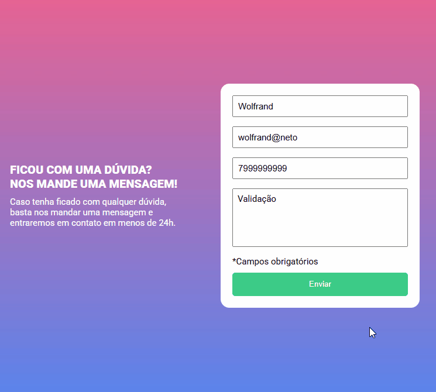

# Formulário que valida informações do usuário

Desafio de JavaScript do curso DevQuest.

## Utilizando

### Desafios

- Lógica de programação
- Manipulação do DOM

### Link

- Minha solução: [Clique aqui para ver](https://wolfrand.github.io/formulario-com-validacao/)

## Processo

### Feito com

- Semantic HTML5 markup
- CSS custom properties
- Flexbox
- Desktop-first workflow
- JS
- Clean code

### O que aprendi

- Manipular o DOM com JavaScript
- Como utilizar a função forEach
- preventDefault para não confirmar envio do formulário
- Verificação de tipo de caractere passado no input de telefone